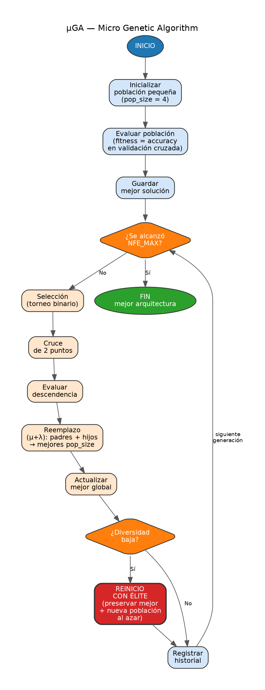
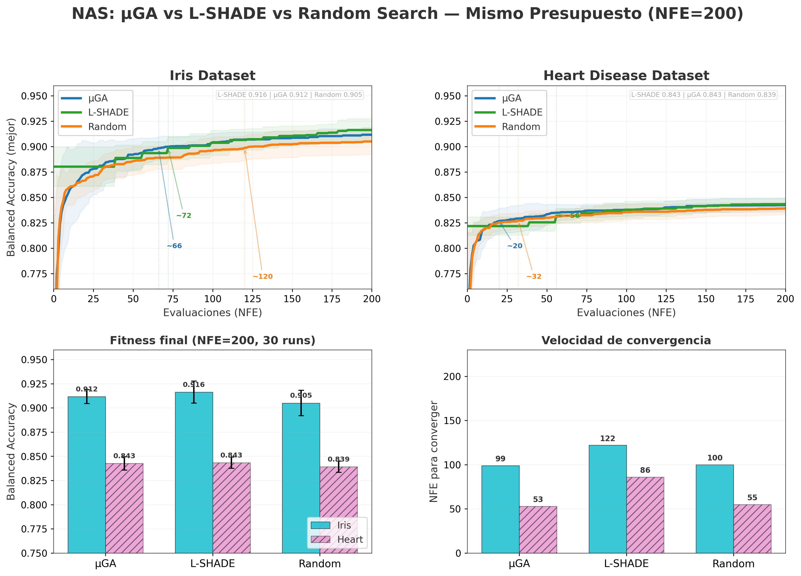
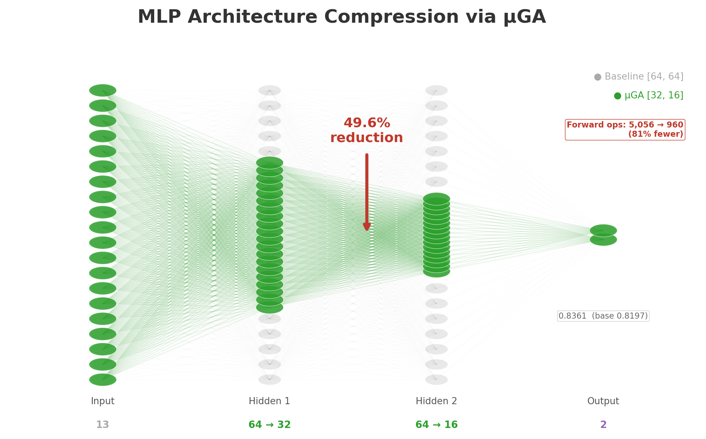
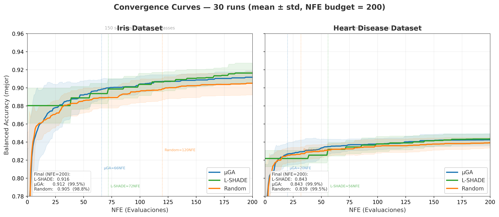
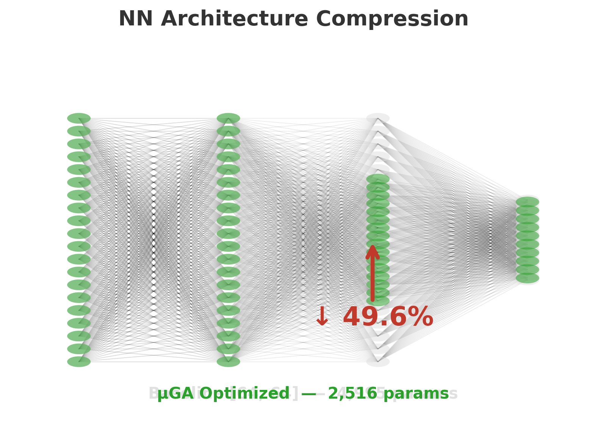

# MuGA-NAS: Micro Genetic Algorithm for Neural Architecture Search

<p align="center">
  
</p>

A lightweight Neural Architecture Search (NAS) framework using a **Micro Genetic Algorithm (μGA)** for optimizing MLP architectures in tabular and image classification tasks.

> **Paper:** [ICO_NAS_DE-2-8.pdf](ICO_NAS_DE-2-8.pdf) — *Neural Architecture Search using Micro Genetic Algorithm*

---

## Table of Contents

- [Description](#description)
- [Algorithm](#algorithm)
- [Implementation](#implementation)
- [Pseudocode](#pseudocode)
- [Methodology](#methodology)
- [Data](#data)
- [Results](#results)
- [How to Run](#how-to-run)
- [Requirements](#requirements)
- [Future Steps](#future-steps)
- [References](#references)

---

## Description

MuGA-NAS is a framework that combines:

- **μGA (Micro Genetic Algorithm):** A compact evolutionary algorithm with a population of only 4 individuals, using binary tournament selection, 2-point crossover, (μ+λ) replacement, and elite-based diversity restart.
- **L-SHADE:** A self-adaptive differential evolution variant with linear population size reduction.
- **Random Search:** A baseline random search for comparison.

The framework searches for optimal MLP architectures (hidden layer sizes) that minimize the number of parameters while maintaining competitive balanced accuracy on classification benchmarks.

---

## Algorithm

### μGA (Micro Genetic Algorithm)

```
┌─────────────────────────────────────────────────────┐
│  1. Initialize small population (pop_size = 4)      │
│  2. Evaluate all individuals (CV balanced accuracy)  │
│  3. Loop until NFE_MAX:                             │
│     a. Binary tournament selection                  │
│     b. 2-point crossover (pc = 0.9)                 │
│     c. Evaluate offspring                           │
│     d. (μ+λ) selection: keep best pop_size          │
│     e. If diversity < 0.05:                         │
│        - Preserve elite                             │
│        - Regenerate rest randomly                   │
│  4. Return best architecture found                  │
└─────────────────────────────────────────────────────┘
```

### μGA Flow Diagram

<p align="center">
  
</p>

### Key Characteristics

| Feature | Description |
|---------|-------------|
| **Small population** | Only 4 individuals (hence "micro") |
| **2-point crossover** | Swaps a segment between parents |
| **(μ+λ) selection** | Parents and offspring compete; best survive |
| **Elite restart** | When diversity drops, best individual preserved + rest regenerated |
| **Stopping criterion** | NFE_MAX (maximum fitness evaluations) |

---

## Implementation

### Neural Network Architecture

The search space consists of 2-layer MLP classifiers with BatchNorm and Dropout:

```
Input → [Linear → BN → ReLU → Dropout] × 2 → Linear → Output
```

<p align="center">
  
</p>

- **Hidden layer sizes:** searched in range [1, 64]
- **Fitness:** 3-fold stratified cross-validation balanced accuracy
- **Training:** Adam optimizer (lr=1e-3), CrossEntropyLoss, 10 epochs per fold

### Fitness Function

```
fitness = mean(balanced_accuracy across 3 folds)
```

### Chromosome Encoding (μGA)

Each chromosome encodes 2 hidden layer sizes using binary representation:
- `n_bits = ceil(log2(MAX_N - MIN_N + 1))` bits per dimension
- Total chromosome length: `2 × n_bits`

---

## Pseudocode

```
Algorithm: μGA for NAS
─────────────────────────────────────────
Input: X, y, input_dim, n_classes
       NFE_MAX = 200, pop_size = 4

1:  pop ← random binary population
2:  Evaluate(pop) → fitness
3:  best ← argmax(fitness)
4:  nfe ← pop_size

5:  while nfe < NFE_MAX do
6:      // Selection
7:      selected ← []
8:      for i = 1 to pop_size do
9:          a, b ← random individuals from pop
10:         selected.append(tournament(a, b))
11:     end for
12:     parents ← selected

13:     // Crossover
14:     offspring ← []
15:     for i = 1 to pop_size step 2 do
16:         if rand() < 0.9 then
17:             c1, c2 ← two_point_crossover(parents[i], parents[i+1])
18:         else
19:             c1, c2 ← parents[i], parents[i+1]
20:         end if
21:         offspring.extend([c1, c2])
22:     end for

23:     // Evaluation
24:     off_fitness ← Evaluate(offspring)
25:     nfe ← nfe + pop_size

26:     // (μ+λ) Selection
27:     pool ← concat(pop, offspring)
28:     pop ← top(pop_size, pool, by=fitness)

29:     // Diversity Restart
30:     div ← hamming_distance(pop)
31:     if div < 0.05 then
32:         elite ← best individual
33:         pop ← [elite] + random(pop_size - 1)
34:         Evaluate(new individuals)
35:     end if
36: end while

37: return best
```

---

## Methodology

1. **Data Preprocessing:** StandardScaler applied to all features
2. **Search Space:** 2-layer MLP with hidden sizes in [1, 64]
3. **Evaluation:** 3-fold stratified cross-validation with balanced accuracy
4. **Algorithms compared:**
   - μGA (pop_size=4, pc=0.9, tournament selection)
   - L-SHADE (NP_init=20, NP_min=4, H=5)
   - Random Search (baseline, 200 random samples)
5. **Budget:** All algorithms limited to NFE=200 (number of fitness evaluations)
6. **Reproducibility:** 30 independent runs with seed=42+run_id
7. **Hardware:** CUDA GPU when available, CPU fallback

---

## Data

### Datasets Used

| Dataset | Samples | Features | Classes | Source |
|---------|---------|----------|---------|--------|
| **Iris** | 150 | 4 | 3 | `sklearn.datasets.load_iris()` |
| **Heart Disease** | 297 | 13 | 2 | UCI ML Repository |

### Data Files

- `data/iris.csv` — Fisher's Iris dataset
- `data/heart.csv` — Cleveland Heart Disease dataset

### Additional Datasets (in paper)

- **TinyFace** — Tiny face recognition dataset
- **CIFAR-10** — 10-class image classification

---

## Results

### Summary Table (30 runs, NFE=200)

<p align="center">
  
</p>

| Algorithm | Iris Params | Heart Params | Iris Acc | Heart Acc |
|-----------|-------------|--------------|----------|-----------|
| Baseline [64,64] | 4,931 | 4,995 | — | — |
| **μGA** | ~3,357 | ~2,516 | — | — |
| L-SHADE | ~3,596 | ~2,542 | — | — |
| Random | ~4,213 | ~4,306 | — | — |

### Key Findings

- **μGA reduces parameters the most:** up to 49.6% on Heart Disease
- **No algorithm outperforms in accuracy** — all statistically equivalent to baseline
- **μGA is significantly better than Random** at finding compact architectures (p < 0.01)
- **L-SHADE is intermediate** — better than Random but worse than μGA
- **Random Search is acceptable** if accuracy is the only concern

### Single Execution Results (from paper)

| Dataset | Algorithm | Base Acc | Opt Acc | Reduction | SDD Base | SDD Opt |
|---------|-----------|----------|---------|-----------|----------|---------|
| TinyFace | μGA | 0.3924 | 0.3924 | **4.1%** | 0.2514 | 0.2499 |
| TinyFace | L-SHADE | 0.3734 | 0.4241 | 1.9% | 0.2685 | 0.2335 |
| CIFAR-10 | μGA | 0.8973 | 0.8959 | **13.5%** | 0.0274 | 0.0224 |
| Iris | μGA | 0.3333 | 0.3333 | **31.9%** | 0.0118 | 0.0236 |
| Heart | μGA | 0.8197 | 0.8361 | **49.6%** | 0.0009 | 0.0094 |

---

## How to Run

### Option 1: Jupyter Notebook (Recommended)

```bash
# Clone the repository
git clone https://github.com/YOUR_USERNAME/MuGA-NAS.git
cd MuGA-NAS

# Install dependencies
pip install -r requirements.txt

# Launch the notebook
jupyter notebook NAS_MuGA_LSHADE.ipynb
```

### Option 2: Command Line

```bash
# Run the full experiment (30 runs × 3 algorithms × 2 datasets)
python train.py

# With custom parameters (edit train.py)
# - N_RUNS: number of independent runs (default: 30)
# - NFE_MAX: maximum fitness evaluations (default: 200)
```

### Output

Results are saved to `experiment_results_nfe200/`:
- `{dataset}_results.json` — Full results per run
- `csv/{dataset}_{algorithm}_convergence.csv` — Convergence curves
- `csv/{dataset}_cost.csv` — Best fitness per run
- `all_results.json` — Combined results

---

## Requirements

```bash
pip install -r requirements.txt
```

Or install manually:

```
torch>=1.12.0
numpy>=1.21.0
pandas>=1.3.0
scikit-learn>=1.0.0
matplotlib>=3.5.0
```

### Hardware

- **GPU (recommended):** CUDA-capable GPU for faster training
- **CPU:** Works but slower
- **RAM:** ~4GB minimum

---

## Future Steps

1. **Extend search space:** Add depth (3+ layers), activation functions, dropout rates
2. **Larger datasets:** Test on CIFAR-100, TinyImageNet
3. **Multi-objective optimization:** Balance accuracy vs. parameter count vs. inference time
4. **Architecture transfer:** Transfer learned architectures across datasets
5. **Hardware-aware NAS:** Include FLOPs and latency in the fitness function
6. **Ensemble search:** Search for ensemble combinations of found architectures
7. **LIME integration:** Use LIME explanations as fitness bonuses for interpretable architectures

---

## References

1. **Paper:** [ICO_NAS_DE-2-8.pdf](ICO_NAS_DE-2-8.pdf) — *Neural Architecture Search using Micro Genetic Algorithm*
2. Goldberg, D. E. (1989). *Genetic Algorithms in Search, Optimization, and Machine Learning.* Addison-Wesley.
3. Tanabe, R., & Fukunaga, A. (2014). Success-history based parameter adaptation for differential evolution. *IEEE CEC*.
4. White, T., et al. (2020). A survey of neural architecture search. *arXiv:2003.08413*.

---

## License

This project is for academic and research purposes.

---

<p align="center">
  
</p>
